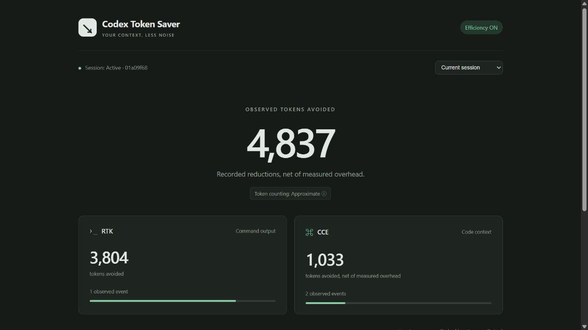

# Codex Token Saver

Local RTK/CCE integration repair and validation: [2026-09-15 repair notes](docs/REPAIR-20260915.md).
CCE startup investigation and real-project timings: [source-first index repair](docs/CCE-STARTUP-20260915.md).

Save Codex context tokens with RTK + CCE, and see the savings live.

[Windows install](#windows) · [Linux install](#linux) · [Beta downloads](https://github.com/fumingyang2004/codex-token-saver/releases/tag/v0.1.0-beta.3)



*Real native CLI session, captured while active. Approximate observed reductions;
not a billing estimate or an ON/OFF benchmark.*

## Windows

Download the **windows-x64.zip** release, extract it, and open PowerShell there:

```powershell
.\install.ps1
```

If local script policy blocks it, invoke the downloaded installer once with
`powershell -ExecutionPolicy Bypass -File .\install.ps1`.
Open a new terminal after installation.

## Linux

Download the **linux-x64.tar.gz** release (Ubuntu 22.04+, x86_64):

```sh
tar -xzf codex-token-saver-v0.1.0-beta.3-linux-x64.tar.gz
./install.sh
```

Open a new terminal, or run `source ~/.profile` in the current shell.

Both installers create an isolated venv and install fixed engine versions.
Python 3.12–3.13 is reused when available; otherwise the installer provisions
Python 3.13.7. Internet access is required. No Node, npm or administrator access.
Codex CLI must already be installed and authenticated.

## Use

```text
codex
codex-saver ui
```

At the first Codex launch, open **`/hooks`**, review and trust the six Token Saver
hooks. Then start a new session. The installer does not bypass native hook trust.
If your existing Codex executable is not on PATH, use `codex-saver run`.

The dashboard uses an authenticated, random localhost port, updates every second,
selects the active root CLI session, and lets you inspect recent sessions.
An idle dashboard says “No active Codex session”.

```text
codex-saver status
codex-saver savings
codex-saver savings --session-id <id> --json
codex-saver doctor
codex-saver disable
codex-saver enable
codex-saver uninstall
```

Disable restores owned configuration; restart existing Codex sessions to unload
already loaded tools. Uninstall preserves telemetry, projects, native sessions
and backups. Edited configuration conflicts are preserved and reported.
Existing config is backed up under `.codex/backups/codex-token-saver/` before writes.

## How it works

**RTK** compresses noisy command output. Native hooks rewrite simple `pytest` and
`git status`, `git diff`, `git log`, `git show` calls. Unsupported or compound
shell expressions pass through unchanged. Each command executes once; no replay
is used to manufacture a baseline.

**CCE** provides local MCP repository discovery. The agent receives short search
guidance; it can use native file tools if context search is unavailable or
insufficient. First use downloads the local embedding model and builds an index.
Large repositories may take time. Existing project CCE configuration is preserved;
incompatible configuration causes a clear native-tool fallback.

**SavingsLedger** records observed before/after transformations. Both CLI and UI
read the same backend summary. Counts use `ceil(UTF-8 bytes / 4)`. Negative measured
overhead is retained; unknown is never silently turned into zero.
Native Codex input, cached input and output are shown separately and never reduced
by the savings number. No prompt, source code or shell output is shown in the UI.

For sandboxed commands, PreToolUse allocates a per-command directory in the
user's temporary directory. The wrapper writes measurements there; host hooks
and the dashboard import them into the session ledger and remove the completed
spool. The installation directory does not need to become sandbox-writable.
See the [Git diff repair and real-directory measurements](docs/RTK-GIT-DIFF-20260915.md).

The RTK card distinguishes calls from measured events and shows the latest
unmeasured reason. Unsupported capture boundaries remain unknown. Git diff
preserves both output streams and exit code 1 for differences, including
`--no-index` comparisons outside a repository. A measured passthrough can save
exactly zero tokens; an empty observed Git diff is measurable too.

## Beta boundaries

- Windows 10/11 and Ubuntu 22.04+ x86_64. Native hooks require Codex 0.154+;
  tested Windows CLI: 0.154.0-alpha.6.2. Managed policies can disable user hooks.
- Root CLI sessions only; IDE and subagent attribution is not promised.
- The first model download requires access to Hugging Face. Retrieval uses local
  FastEmbed; CCE standard compression may try local Ollama and fall back locally.
- Savings measure supported observed buffers, not all overhead, credits, or a
  whole-session counterfactual. Unsupported observation boundaries stay unknown.
- No Router, Batch, Token Optimizer or automatic agent routing.

See [validation and actual session numbers](docs/VALIDATION.md),
[architecture and migration](docs/ARCHITECTURE.md), and
[third-party notices](THIRD_PARTY_NOTICES.md).
